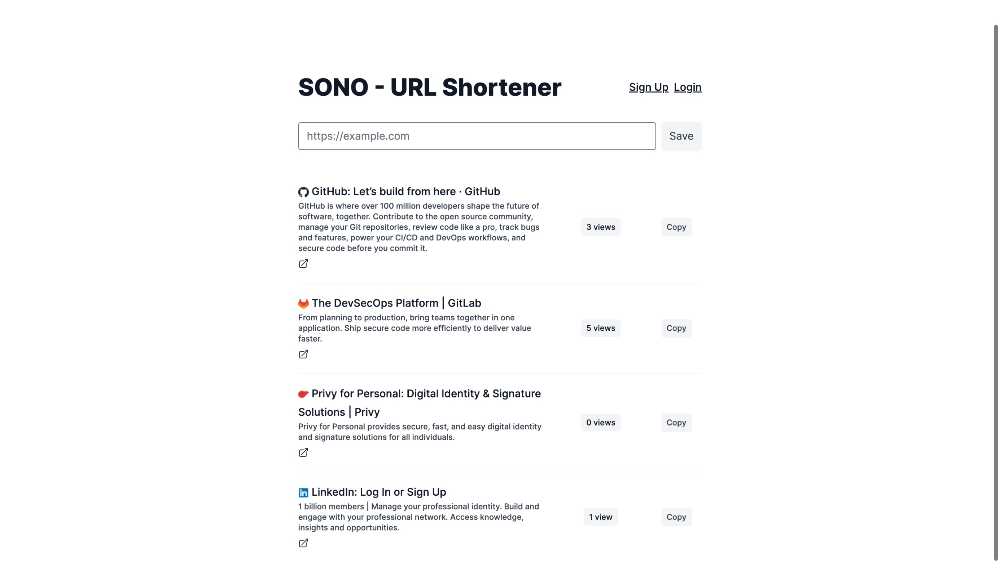
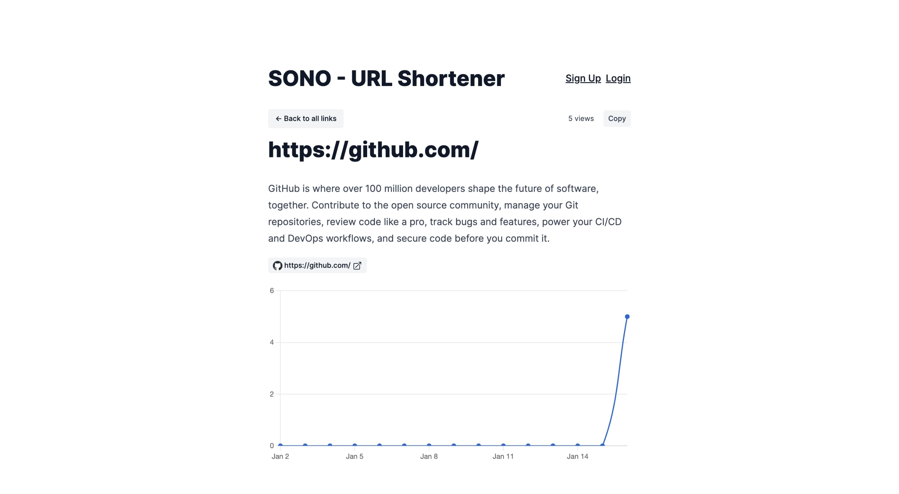

# SONO - URL Shortener

SONO is a lightweight URL shortener designed to simplify the process of creating, managing, and tracking shortened URLs. Developed with functionality and efficiency in mind, SONO provides a range of features for users without unnecessary complexity.

## Features

1. **URL Submission:**

   - Users can submit URLs via a straightforward form on the homepage.

2. **Database Integration:**

   - URLs are securely stored in the database for easy retrieval.

3. **Short URL Generation:**

   - Each URL is assigned a unique Base62 encoded primary key ID, forming the short code.
   - Access short URLs at `/v/:id`.

4. **Clipboard Copy:**

   - Facilitates easy sharing by allowing users to copy short URLs to the clipboard.

5. **View Tracking:**

   - Records views when accessing the short code.
   - Tracks the total number of views for each URL.

6. **Analytics Dashboard:**

   - Visualize URL performance with a graph displaying views over the past 2 weeks.

7. **URL Metadata Retrieval:**

   - Retrieves title, description, and OpenGraph image for HTML documents.
   - Background tasks ensure responsiveness and update metadata upon URL edits.

8. **URL Editing and Deletion:**

   - Users can edit and delete their shortened URLs.

9. **Pagination:**
   - Organizes the list of shortened URLs with pagination for a clean interface.

## Short URL Format

Short URLs follow the format: `https://yourdomain.com/v/:id`

## View Analytics

1. Visit a shortened URL.
2. Explore the analytics graph showcasing views over the past 2 weeks.

## URL Editing and Deletion

1. Log in to edit a URL and update its details.
2. Easily delete a URL through the provided interface.

## Background Tasks

Efficient background tasks manage URL metadata retrieval, ensuring optimal performance without impacting user experience.
